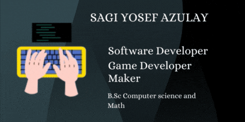

- Feel free to visit my GitHub profile, where you can explore a range of my projects, including various technological endeavors such as games in development, deep learning, artificial intelligence, and robotics projects. For any inquiries, you are welcome to contact me through my email address or LinkedIn profile.

### 🤝 Connect with me:
  
  
- 💬 If you have any question/feedback, please do not hesitate to reach out to me!

## 💼 Technical Skills

<!---
sagir567/sagir567 is a ✨ special ✨ repository because its `README.md` (this file) appears on your GitHub profile.
You can click the Preview link to take a look at your changes.
--->
